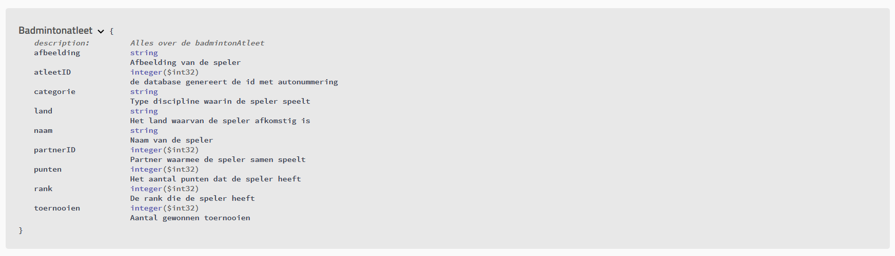
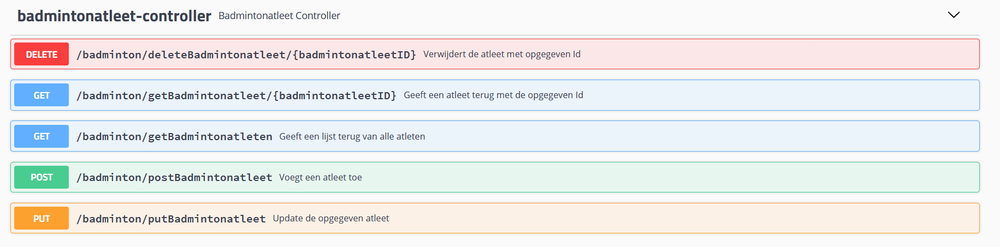
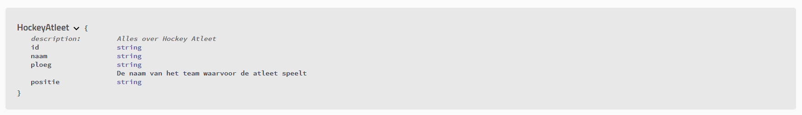
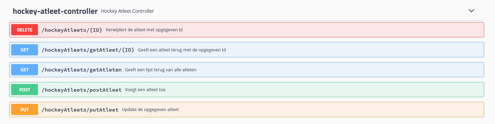
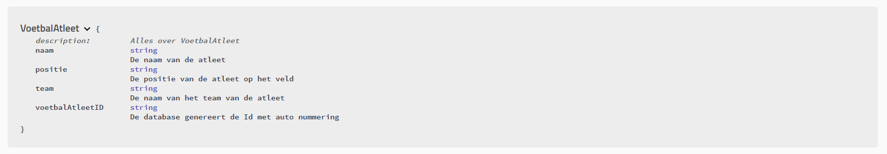
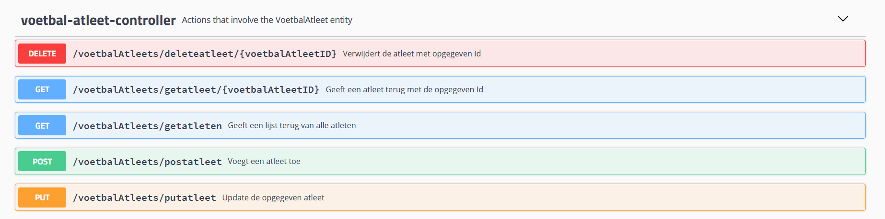
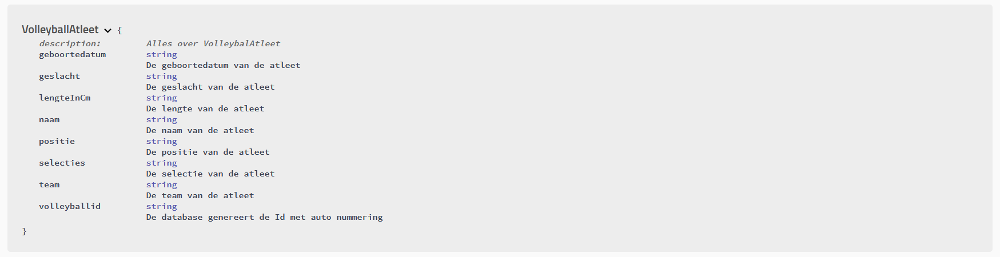
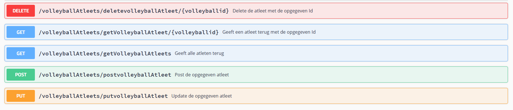

# Athleter

Athleter is een webapplicatie waar gebruikers atleten van bepaalde sporten kunnen bekijken en beheren. 

Deze spring boot applicatie bestaat uit:
    - 4 microservices, 
    - een edge-service, 
    - een eureka server,
    - een zuul gateway  
    - een Angular front-end.

## Team

Jasper Cools, Nerissa Janssens, Bart Ooms, Jasey Waegebaert

## Swagger

### Badminton

### Hockey

### Voetbal

### Volleybal

